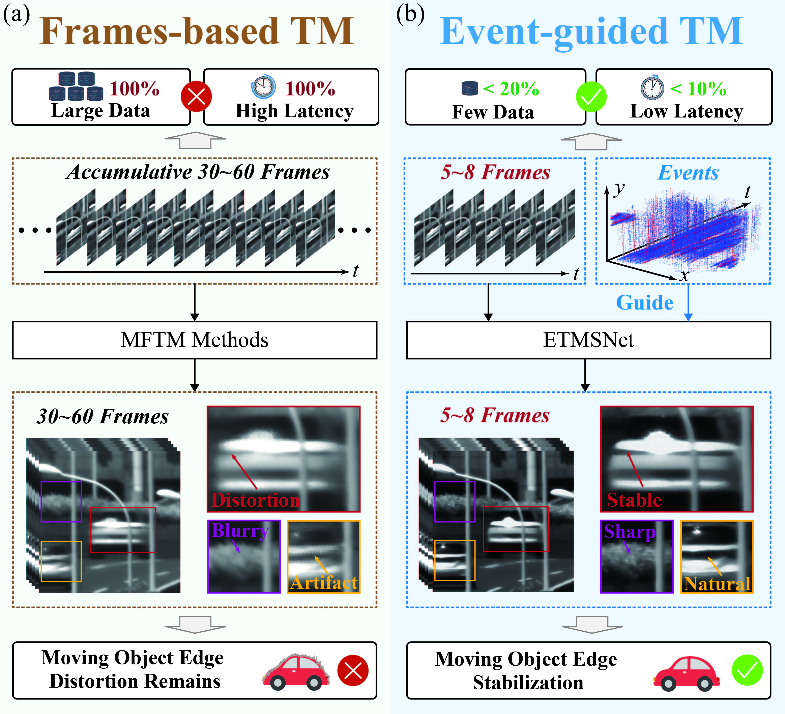
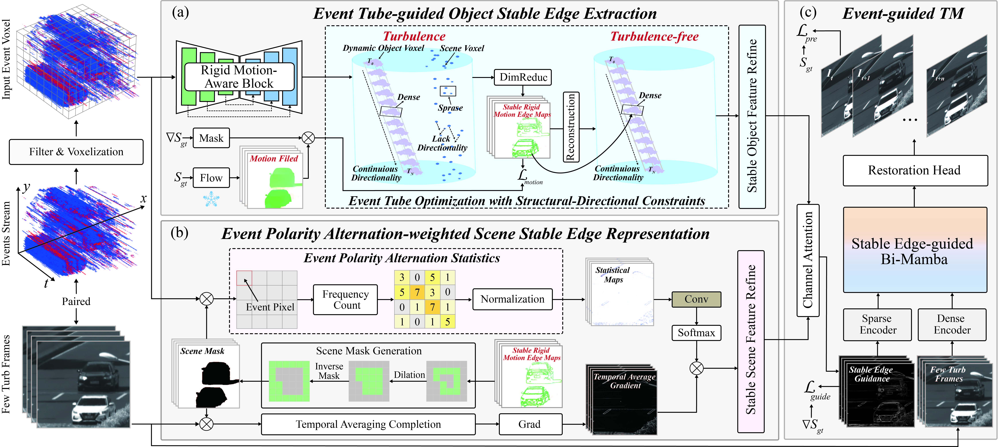

# High-Quality and Efficient Turbulence Mitigation with Events

<p align="center"><strong>CVPR 2026 Highlight</strong></p>

<p align="center">
  Xiaoran Zhang · Jian Ding · Yuxing Duan · Haoyue Liu · Gang Chen · Yi Chang · Luxin Yan
</p>

<p align="center">
  <a href="https://arxiv.org/abs/2603.20708"></a>
  <a href="https://youtu.be/oZrPr5Mmn6c?si=PvmLqcTke8P2lcFD"></a>
  <a href="#dataset"></a>
  <a href="#code-and-models"></a>
</p>

<p align="center">
  <a href="https://arxiv.org/abs/2603.20708">Paper</a> ·
  <a href="#video">Video</a> ·
  <a href="#dataset">Dataset</a> ·
  <a href="#environment">Installation</a> ·
  <a href="#inference">Inference</a> ·
  <a href="#training">Training</a> ·
  <a href="#citation">Citation</a>
</p>

Official PyTorch implementation of **EHETM**, an event-guided framework for high-quality and efficient turbulence mitigation. This repository provides the complete staged training pipeline, unified inference for synthetic and real data, dataset resources, and checkpoints that support both inference and continued training.

## News

- **2026-08-19:** We have expanded the benchmark with a new simulated dataset, EFTSim, and two real-world datasets, CTTH+ and LATH+, all of which provide complete event streams and IMU-based ego-motion measurements and will be released soon.
- **2026-08-19:** Training and inference code is now available.
- **2026-03-27:** The CTTH and LATH datasets were released.
- **2026-03-25:** The paper was published on [arXiv](https://arxiv.org/abs/2603.20708).
- **2026-02-23:** EHETM was accepted by CVPR 2026 as a Highlight paper.

## Overview

Atmospheric turbulence causes spatially varying geometric distortion and blur, making long-range imaging difficult. EHETM uses high-temporal-resolution event measurements to guide motion estimation and image restoration while retaining an efficient model design.





## Video

<p align="center">
  <a href="https://youtu.be/oZrPr5Mmn6c?si=PvmLqcTke8P2lcFD">
    
  </a>
</p>

<p align="center">
  <a href="https://youtu.be/oZrPr5Mmn6c?si=PvmLqcTke8P2lcFD"><strong>▶ Watch the EHETM project video on YouTube</strong></a>
</p>

## Dataset

We release two event-based turbulence datasets for evaluating turbulence mitigation in controlled and long-range real-world environments.

| Dataset | Setting | Contents | Download |
| --- | --- | --- | --- |
| **CTTH** | Controlled turbulence testbed | Static and dynamic scenes with frames, events, ground truth, and flow | [Baidu Netdisk](https://pan.baidu.com/s/1XsDaJTYYfcgNENzEL0_wqw?pwd=qaz3) (code: `qaz3`) |
| **LATH** | Long-range atmospheric turbulence | Real outdoor observations at 3.5 km, 5 km, 6.5 km, and 8 km | [Baidu Netdisk](https://pan.baidu.com/s/1XsDaJTYYfcgNENzEL0_wqw?pwd=qaz3) (code: `qaz3`) |
| **Additional data** | Simulated and real-world measured sequences | Complete event streams and IMU ego-motion measurements | [Baidu Netdisk](https://pan.baidu.com/) (coming soon) |

### Additional dataset (coming soon)

We are preparing an expanded dataset comprising both simulated sequences and real-world measurements. The collection provides complete event streams and IMU ego-motion measurements for broader evaluation under complementary controlled and measured conditions. A Baidu Netdisk download link will be added here when the data are released.

### CTTH

The **Controlled Turbulence Testbed with High-Speed Events (CTTH)** dataset contains both static and dynamic scenes captured under controlled turbulence. Each sample provides synchronized frame and event measurements; the dynamic subset additionally contains optical-flow annotations used by the training pipeline.

```text
CTTH/
├── Dynamic_Object/
│   ├── Train/
│   │   └── <sequence>/
│   │       ├── GT/
│   │       ├── Turb/
│   │       └── Flow/
│   └── Test/
│       └── <sequence>/
│           ├── GT/
│           ├── Turb/
│           └── Flow/
└── Static_Object/
    └── <sequence>/
        ├── GT/
        └── Turb/
```

| Static scene 1 | Static scene 2 |
|:---:|:---:|
| Ground truth | Ground truth |
|  |  |
| Turbulence frames | Turbulence frames |
|  |  |
| Events | Events |
|  |  |

| Dynamic scene 1 | Dynamic scene 2 |
|:---:|:---:|
| Ground truth | Ground truth |
|  |  |
| Turbulence frames | Turbulence frames |
|  |  |
| Events | Events |
|  |  |

### LATH

The **Long-range Atmospheric Turbulence with High-Speed Events (LATH)** dataset contains event and frame measurements captured over real atmospheric paths ranging from 3.5 km to 8 km. It is intended to evaluate generalization under realistic, long-range turbulence.

| Distance | Turbulence frames | Events |
|:---:|:---:|:---:|
| 3.5 km |  |  |
| 5 km |  |  |
| 6.5 km |  |  |
| 8 km |  |  |

The event data are stored as `.npz` files containing `x`, `y`, `p`, and `t`. Data were captured with an [ALPIX-Pizol event camera](https://www.alpix.com.cn/).

## Code and Models

### Repository structure

```text
EHETM/
├── Code/
│   ├── Data/                         # EFTurb and CTTH+ dataset loaders
│   │   └── splits/                   # Deterministic test manifests
│   ├── Model/                        # ET, EPAW, and Ref-MambaTM
│   ├── Utils/                        # Metrics and training utilities
│   ├── infer_final.py                # Unified inference and evaluation
│   ├── train_stage1_et.py
│   ├── train_stage2_epaw.py
│   ├── train_stage3_restoration.py
│   ├── train_stage3_finetuning.py
│   └── requirements.txt
├── assets/                            # README figures and examples
└── tools/
    └── event_processing.py            # Event preprocessing utility
```

### Environment

The code has been validated with:

- Ubuntu 18.04
- Python 3.11.13
- PyTorch 2.1.1 with CUDA 12.1
- NVIDIA RTX 3090

An NVIDIA GPU is required by the selective-scan and causal-convolution kernels used in Ref-MambaTM. A matching CUDA toolkit and a working C/C++ compiler are required when building `mamba-ssm` and `causal-conv1d`.

```bash
git clone https://github.com/Xavier667/EHETM.git
cd EHETM/Code

conda create -n ehetm python=3.11 -y
conda activate ehetm

# Install PyTorch first so the CUDA extensions can compile against it.
pip install torch==2.1.1+cu121 torchvision==0.16.1+cu121 \
  --extra-index-url https://download.pytorch.org/whl/cu121
pip install -r requirements.txt --no-build-isolation
```

Verify the installation:

```bash
python -c "import torch; print(torch.__version__, torch.version.cuda, torch.cuda.is_available())"
```

LPIPS initializes an AlexNet backbone on first use and may download its pretrained weights when they are not already cached.

### Checkpoints

The three released checkpoints retain the model parameters and the optimizer, scheduler, AMP scaler, and training-progress states required to continue training. The public filenames intentionally do not encode training epochs.

| Checkpoint | Training domain | Baidu Netdisk |
| --- | --- | --- |
| `restoration_event_guided_finetune_CTTH.pt` | CTTH+ | [Baidu Netdisk](https://pan.baidu.com/s/1l4Dglqffld-TfRbDI9E_qw) (code: `qaz3`) |
| `restoration_event_guided_finetune_EFTURB.pt` | EFTurb | [Baidu Netdisk](https://pan.baidu.com/s/1l4Dglqffld-TfRbDI9E_qw) (code: `qaz3`) |
| `restoration_event_guided_finetune_Joint.pt` | CTTH+ and EFTurb | [Baidu Netdisk](https://pan.baidu.com/s/1l4Dglqffld-TfRbDI9E_qw) (code: `qaz3`) |

Download and extract the checkpoint package, then place the three `.pt` files in `Code/checkpoints/`. Every checkpoint can be used directly for inference or passed to the fine-tuning script with `--finetune-resume`.

### Model-ready data layout

The released loaders expect preprocessed EFTurb and CTTH+ data in the following layouts. Dataset locations are always supplied through command-line arguments; no machine-specific absolute paths are embedded in the code.

<details>
<summary><strong>EFTurb layout</strong></summary>

```text
EFTurb/
└── <scenario>/<sequence>/
    ├── Turb/
    │   ├── frames/<frame>.png
    │   ├── events/<frame>.npz
    │   └── event_voxel/<frame>.npz
    ├── GT/frames/<frame>.png
    └── Optical_Flow/
        ├── raw_gradient_flow_new_scalar_npz/<frame>.npz
        └── raw_gradient_png_8bit/<frame>.png
```

</details>

<details>
<summary><strong>CTTH+ layout</strong></summary>

```text
CTTH+_Dataset/
└── seq_*/
    ├── Turb/
    │   ├── frames_gray/<frame>.png
    │   ├── events/<frame>.npz
    │   └── event_voxel/<frame>.npz
    ├── GT/frames_gray/<frame>.png
    └── Flow/
        ├── raw_gradient_flow_scalar_npz/<frame>.npz
        └── raw_gradient_png_8bit/<frame>.png
```

</details>

Expected NPZ fields:

- Event stream: `x`, `y`, `p`, and `t`.
- Event voxel: `voxel`, with shape `[2, 10, H, W]`.
- Scalar flow target: `raw_gradient_flow`, with shape `[1, H, W]`.

Frame stems must be numeric. The default deterministic split uses seed `42` and a `0.9` training ratio. The released test sequence lists are in `Code/Data/splits/`. See `tools/event_processing.py` for event preprocessing.

## Inference

Run the following commands from `EHETM/Code`.

### EFTurb

```bash
python infer_final.py \
  --checkpoint checkpoints/restoration_event_guided_finetune_EFTURB.pt \
  --data-format efturb \
  --data-root /path/to/EFTurb \
  --test-list Data/splits/efturb_test_seed42_ratio0.9.txt \
  --output outputs/efturb \
  --tile-size 512 --overlap 64 --amp
```

### CTTH+

```bash
python infer_final.py \
  --checkpoint checkpoints/restoration_event_guided_finetune_CTTH.pt \
  --data-format ctth \
  --data-root /path/to/CTTH+_Dataset \
  --test-list Data/splits/ctth_test_seed42_ratio0.9.txt \
  --output outputs/ctth \
  --tile-size 512 --overlap 0 --amp
```

The joint checkpoint uses the same command with `restoration_event_guided_finetune_Joint.pt` and either supported `--data-format`.

### Real event-camera data

Ground truth is optional for real measurements:

```bash
python infer_final.py \
  --checkpoint checkpoints/restoration_event_guided_finetune_Joint.pt \
  --data-format real \
  --data-root /path/to/real_sequences \
  --gt none \
  --output outputs/real \
  --tile-size 512 --overlap 64 --amp --save-guide
```

Each real sequence may use `frames/`, `events/`, and `event_voxel/`; the EFTurb and CTTH+ layouts are also accepted. If ground truth is present, use `gt/` or `ground_truth/` and retain the default `--gt auto`.

Inference writes restored PNG files, optional guidance maps, per-frame `metrics.csv`, and `summary.json`. Only the following image-quality metrics are reported:

- PSNR on grayscale images in `[0, 1]`;
- SSIM on grayscale images in `[0, 1]`;
- LPIPS after converting grayscale inputs to three channels in `[-1, 1]`.

When ground truth is unavailable, metric values are left empty.

Useful options include `--temporal-mode sliding-center`, `--temporal-mode nonoverlap-all`, `--max-samples N`, `--save-guide`, `--frames`, and `--voxel-scale`. Run `python infer_final.py --help` for the complete interface.

## Training

All training scripts support command-line data and output paths. Run commands from `EHETM/Code`.

<details open>
<summary><strong>Stage 1: Event-to-motion network (ET)</strong></summary>

```bash
python train_stage1_et.py \
  --data-root /path/to/EFTurb \
  --output checkpoints/stage1_et.pt
```

Stage 1 uses the non-static EFTurb scenarios and supervises multi-frame event-to-motion prediction.

</details>

<details>
<summary><strong>Stage 2: Event prior alignment and weighting (EPAW)</strong></summary>

```bash
python train_stage2_epaw.py \
  --data-root /path/to/EFTurb \
  --et-checkpoint checkpoints/stage1_et.pt \
  --output checkpoints/stage2_epaw.pt
```

ET is frozen in Stage 2. The resulting checkpoint contains both ET and EPAW weights.

</details>

<details>
<summary><strong>Stage 3: Restoration pretraining</strong></summary>

```bash
python train_stage3_restoration.py \
  --efturb-root /path/to/EFTurb \
  --ctth-root /path/to/CTTH+_Dataset \
  --output checkpoints/stage3_restoration.pt
```

This stage jointly pretrains Ref-MambaTM with degraded-image gradient guidance.

</details>

<details>
<summary><strong>Stage 3: Event-guided fine-tuning</strong></summary>

```bash
python train_stage3_finetuning.py \
  --finetune-dataset joint \
  --efturb-root /path/to/EFTurb \
  --ctth-root /path/to/CTTH+_Dataset \
  --epaw-checkpoint checkpoints/stage2_epaw.pt \
  --restoration-pretrained checkpoints/stage3_restoration.pt \
  --output checkpoints/stage3_finetune_joint.pt
```

Set `--finetune-dataset` to `efturb`, `ctth`, or `joint`.

</details>

### Continue training from a released checkpoint

Use `--finetune-resume` to restore the model, optimizer, scheduler, and scaler states. Set `--epochs` to the desired stopping point when needed.

```bash
python train_stage3_finetuning.py \
  --finetune-dataset joint \
  --efturb-root /path/to/EFTurb \
  --ctth-root /path/to/CTTH+_Dataset \
  --finetune-resume checkpoints/restoration_event_guided_finetune_Joint.pt \
  --output checkpoints/stage3_finetune_joint.pt
```

### Multi-GPU training

```bash
torchrun --standalone --nproc_per_node=2 train_stage3_finetuning.py \
  --gpus 0,1 \
  --finetune-dataset joint \
  --efturb-root /path/to/EFTurb \
  --ctth-root /path/to/CTTH+_Dataset \
  --epaw-checkpoint checkpoints/stage2_epaw.pt \
  --restoration-pretrained checkpoints/stage3_restoration.pt
```

The number of `torchrun` processes must match the number of GPUs selected with `--gpus`. Training logs and validation outputs report PSNR, SSIM, and LPIPS only.

## Reproducibility

- Random seeds default to `42`.
- Event voxels use signed log normalization with `voxel_scale=4.0`.
- Flow targets use non-negative log normalization with `flow_scale=4000.0`.
- Training crops must be positive and divisible by four.
- Use the manifests in `Code/Data/splits/` for directly comparable evaluation.

## Citation

If this work or the released datasets are useful in your research, please cite our paper and consider starring the repository.

```bibtex
@article{zhang2026high,
  title={High-Quality and Efficient Turbulence Mitigation with Events},
  author={Zhang, Xiaoran and Ding, Jian and Duan, Yuxing and Liu, Haoyue and Chen, Gang and Chang, Yi and Yan, Luxin},
  journal={arXiv preprint arXiv:2603.20708},
  year={2026}
}
```
